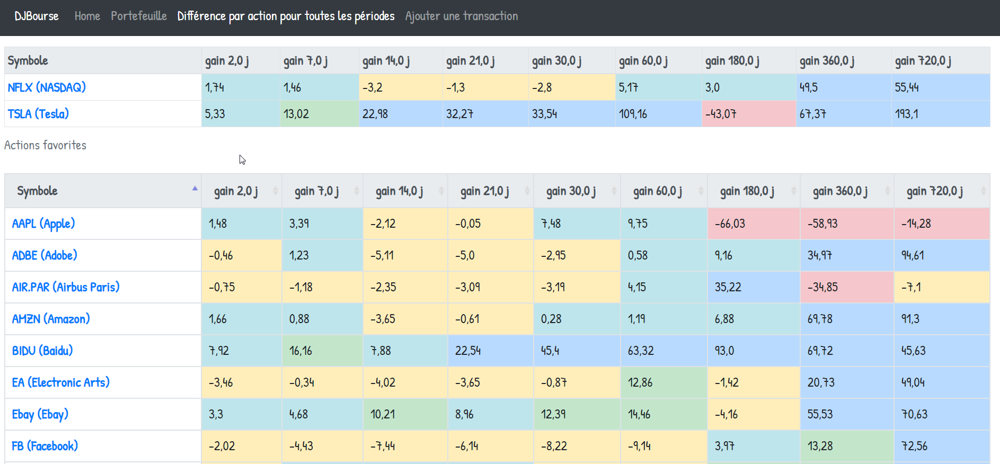

# djbourse

This django app helps me monitor some stocks. It is using [AlphaVantage](https://rapidapi.com/alphavantage/api/alpha-vantage) API to get prices history for monitored stocks. It needs an api_key from AlphaVantage. When you have it, you can add it to the table AlphaVantageApiKey via django admin. If you use the batch file below, you have to put the api_key as parameter in order to update prices.

# .BAT Example for prices update (run each day)
Create a bat file and put the code below. I have created a scheduled task which run each day to download json file for each stocks with flag **monitored** or **is_favorite** and add prices to database.

```
echo off

call djbourse\venv\Scripts\activate.bat

call python djbourse\update_prices.py --api_key "xxx" --folder_data djbourse\data

call djbourse\venv\Scripts\deactivate.bat
```
Below is an example of the page which show percentage diff by period for all stocks. Stocks can be put in favorite table, in monitored table, or can be set to not monitored.
Each cell has a color depending on level of difference between current price and previous price.


